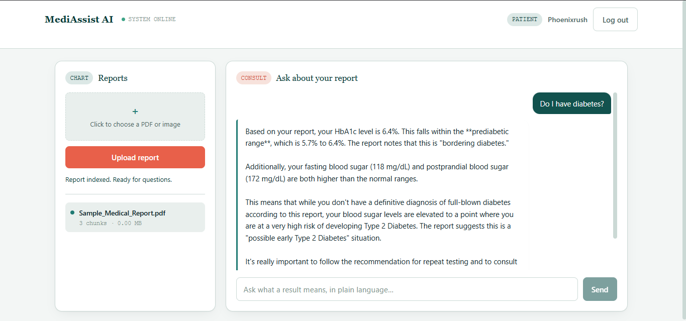

# 🏥 MediAssist AI — Frontend

The React interface for [MediAssist AI](#-related-repos) — upload a medical report, then ask questions about it in a streaming chat interface with a custom clinical design system.

> 🔗 **Live demo:** [mediassist-frontend-phoenix-rush1.vercel.app](https://mediassist-frontend-phoenix-rush1.vercel.app) *(update with your production Vercel URL)*

---

## ✨ Features

- 🔐 Login / register with a role picker (Patient / Doctor)
- 📄 Drag-and-drop-style report upload with live status
- 📊 A running list of uploaded reports for the session
- 💬 A streaming chat interface — responses render token-by-token as the backend streams them
- 🎨 A custom clinical design system — deep teal + a single coral "vital sign" accent, paired with a serif display face and a monospace face for lab-style data, tied together by an animated ECG pulse-line motif used both as a page accent and as the "reading the report" loading indicator
- 📱 Responsive layout — the two-panel dashboard stacks on mobile

---

## 🛠️ Tech Stack

- **React** + **Vite**
- Plain CSS with a token-based design system (`index.css`) — no UI framework dependency
- Fonts: [Fraunces](https://fonts.google.com/specimen/Fraunces) (display), [Inter](https://fonts.google.com/specimen/Inter) (body), [IBM Plex Mono](https://fonts.google.com/specimen/IBM+Plex+Mono) (data)
- Hosting: Vercel

---

## ⚙️ Local Setup

```bash
git clone https://github.com/Phoenix-rush/mediassist-frontend.git
cd mediassist-frontend
npm install
npm run dev
```

Runs on `http://localhost:5173` by default. Requires the [backend](https://github.com/Phoenix-rush/mediassist-backend) to be running.

---

## 🔑 Environment Variables

Create a `.env` file in the project root:

```
VITE_API_BASE=http://localhost:5000/api
```

In production (Vercel), set `VITE_API_BASE` to your deployed backend's `/api` URL under the project's **Environment Variables** settings.

---

## 📁 Project Structure

```
src/
├── App.jsx                 # Auth gate + dashboard layout
├── index.css                # Design tokens and shared styles
├── config.js                 # API base URL
└── components/
    ├── AuthScreen.jsx       # Login / register split-screen
    ├── Sidebar.jsx           # Upload form + report list ("Chart")
    ├── ChatBox.jsx           # Streaming chat panel ("Consult")
    └── PulseLine.jsx         # Signature animated ECG motif
```

---

## 📸 Screenshots

*(add screenshots of the login screen and chat interface here)*

```markdown


```

---

## 🔗 Related Repos

- **Backend:** [mediassist-backend](https://github.com/Phoenix-rush/mediassist-backend)

---

## 🚧 Roadmap

- [ ] Persist login across page refresh once the backend exposes `/api/auth/me`
- [ ] Per-document delete from the sidebar
- [ ] Filename search when referring to a specific report

---

## 📝 License

MIT
